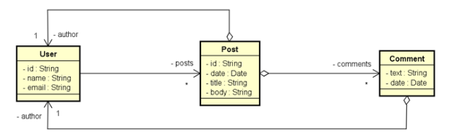

# 💻 DS Post

A api DS Post permite que você crie usuários, busque todos eles e também seus posts criados.

**Atenção**: Você precisa ter o java jdk 11 instalado na sua máquina bem como o `PATH_VARIABLE` do java configurado e
uma IDE de sua preferência.

## 🔌 Configurações para inicialização

- **O back end está setado em modo de TESTE, sua aplicação funcionará localmente. Porém é necessário ter o mongodb instalado
na máquina local**

Após baixar as dependências, execute a aplicação e a api estará rodando em http://localhost:8080.

## 🗺️ Diagrama de Classes - Modelo de Domínio



## 📌 Endpoints

Os seguintes endpoints estão configurados:

### User

- `/users` - POST - Cria um usuário na aplicação.
- `/users` - GET - Retorna todos os usuários cadastrados na aplicação.
- `/users/<id>` - GET - Retorna um usuário específico a partir do seu id.
- `/users/<id>/posts` - GET - Retorna os posts de um usuário a partir do seu id.

**Exemplo de dados para criar um USUÁRIO (JSON)**

```json
{
  "name": "Bob Brown",
  "email": "bob@email.com"
}
```


### Post

- `/posts/<id>` - GET - Retorna um post a partir do seu id.
- `/posts/titlesearch?text=some title` - GET - Retorna uma lista de posts dado o título passado como
uma **query string**.


## Coleções para Postman/Insomnia
- Existe uma collection pré-definada na raiz do projeto em ./postman/
- Você pode importa-la no seu client http e fazer uso das requisições pré-configuradas.


## 🛠️ Ferramentas

1. Kotlin
2. Springboot
3. Spring Web
4. Spring Data MongoDB
5. Spring Validation

## 💾 Dados para povoar a api

O arquivo TestConfig.kt em `com.devgabriel.dspost/configuration` realiza o seed no banco de dados mongodb no 
ambiente de testes.